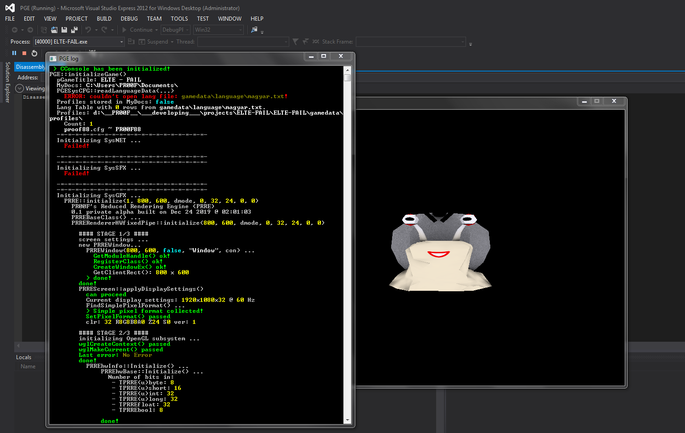
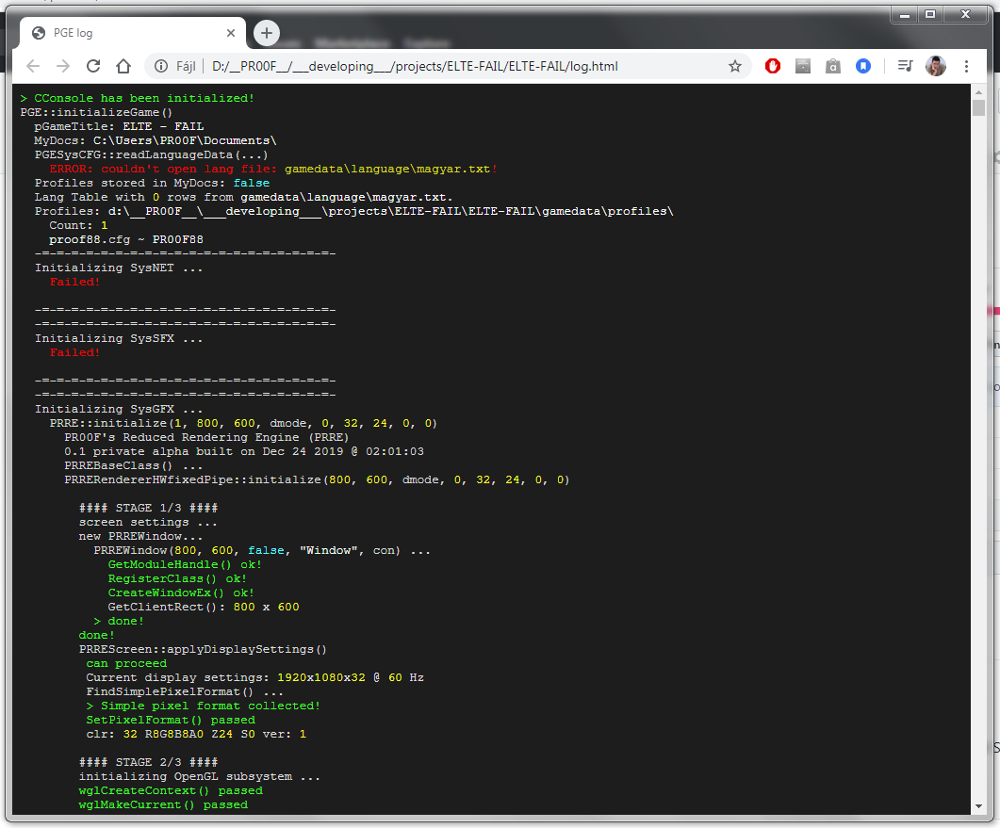

# Console
Console class for logging purpose on Windows and hopefully later on Linux.  
I wouldn't write this from scratch today, but back in 2011 I wanted to write a logger class that has function with variable number of parameter count, so I made this.  
Today I would rather just use a nice open-source product maintained by someone else. But since I wrote this, I'm still using it!

**Features** of v1.3:
 - logging to console window (currently only on Windows);
 - logging to html file, with same indentations and colors as to console window;
 - delete old html log files during initialization;
 - per-module log filtering: you can decide what a module is (e.g. a class) and add per-module (e.g. per-class) usage of CConsole::SetLoggingState() with your module name string to turn on/off logging;
 - thread-safety.

**Missing Features (with priority):**
 - HIGH: turn on logging ONLY into html file, not to console window (currently logging to html works only when console window is also present): [Link to Issue](https://github.com/proof88/Console/issues/1);
 - MED: if module logging not enabled but the module is logging an error, the module name should be also logged automatically for more clarity;
 - MED: timestamping (optional);
 - MED: add aux string to filename even later after initialization is already done (in such case the file name should be renamed);
 - LOW: automatically write the module name at the beginning of the line (optional);
 - LOW: optionally the "ERROR" string automatic logging in case of error log could be turned on;
 - LOW: config file (that could contain e.g. module logging setting);
 - LOW: no log file rotation implemented;
 - LOW: no log forwarding to external server;
 - LOW: no actions to be executed when a specific log appears.

Currently I'm planning to implement only the HIGH PRIO missing features.

**Known Issues:**
As described in comment in [CConsole.h](https://github.com/proof88/Console/blob/master/CConsole/src/CConsole.h).

**Requires**: [PFL v1.2](https://github.com/proof88/PFL).

Note that this project is NOT unit-tested, only some showcase tests are implemented in [conmain.cpp](https://github.com/proof88/Console/blob/master/CConsole/src/conmain.cpp).  
If you want to run this, you have to go to **Project Settings** in Visual Studio, then **General Settings**, and change **Configuration Type** from **Static Library** to **Application**. Then simply Build & Run!

  Example: Windows console window during demo run: 
  

  

  The generated log HTML opened in web browser: 
  

The Visual Studio project file is included. The project is configured for Cpp17 because of using std::filesystem. 
However, if you want to see example of integration in other projects, you may be interested in the Visual Studio solution including other projects as well in [PGE-misc](https://github.com/proof88/PGE-misc) repo.
